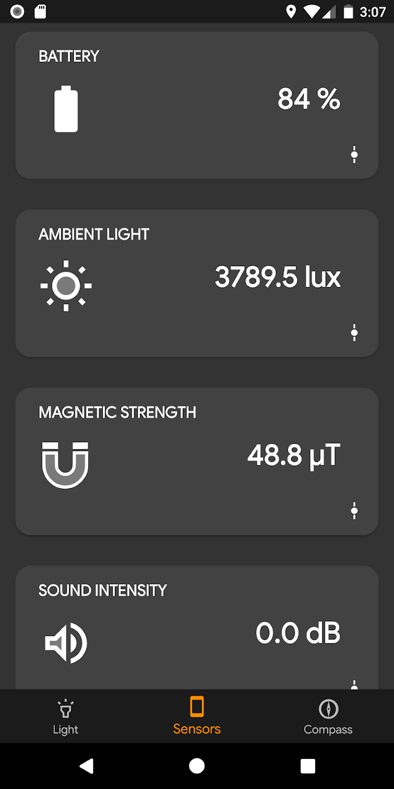
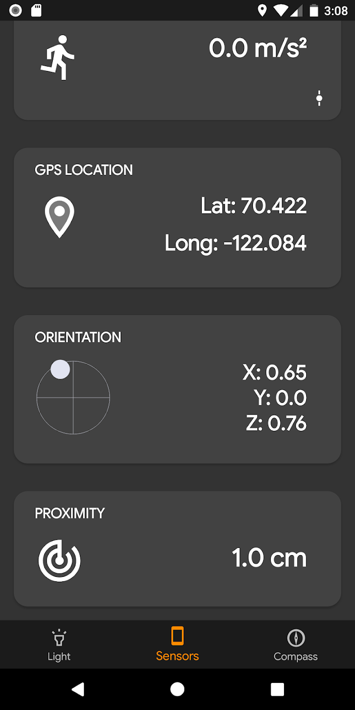
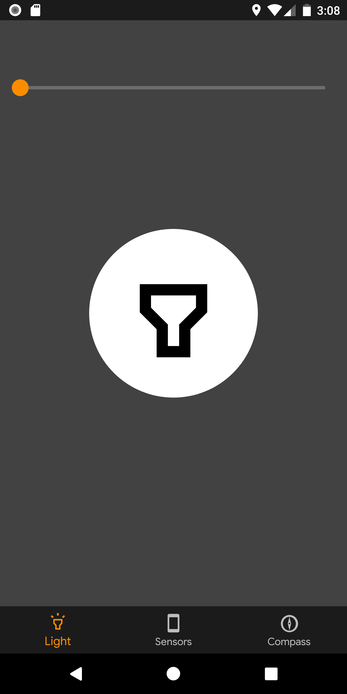
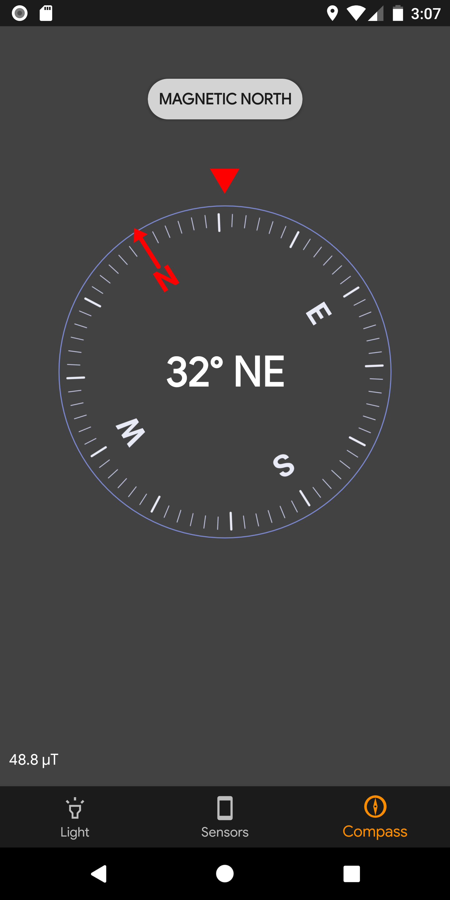
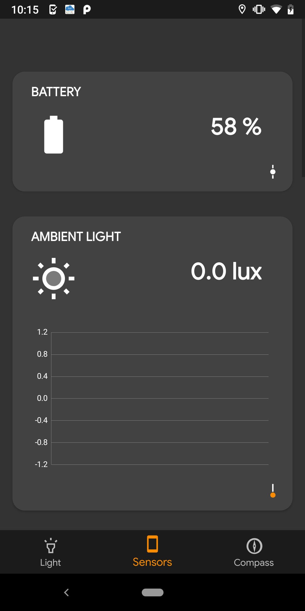

# AniniTools

[](https://play.google.com/store/apps/details?id=anini.aninitools&hl=en)
[](https://android-arsenal.com/api?level=24)
[](LICENSE)

A powerful, beautiful Android utility app combining flashlight controls, comprehensive sensor measurements, and compass functionality - all in one elegant interface.

## Features

### Flashlight
- **Variable Strobe Control** - Adjustable strobe speed from continuous to rapid flashing
- **Concert Mode** - Full-screen color flash with customizable text and colors
- **Screen Flash** - Use your screen as a flashlight with customizable colors
- **Camera Flash** - Traditional LED flashlight with precise control

### Sensor Measurements
- **Battery Analytics** - Real-time voltage, temperature, capacity, charging status
- **Environmental Sensors**
  - Ambient light intensity (lux)
  - Atmospheric pressure (hPa)
  - Ambient temperature
- **Motion & Orientation**
  - Linear acceleration with 3-axis measurement
  - Gyroscope with angular velocity tracking
  - Device orientation (pitch, roll, azimuth)
- **Magnetic Field** - Magnetic strength measurement (μT)
- **Audio Analysis**
  - Sound intensity in decibels (dB)
  - Pitch frequency detection (Hz)
  - Musical note identification
- **Location Services**
  - GPS coordinates (latitude/longitude)
  - Precision tracking
- **Proximity Detection** - Distance sensing
- **Real-time Graphs** - Visual representation of sensor data over time

### Compass
- **Magnetic North** - Accurate compass with smooth rotation
- **Degree Display** - Precise heading information

## Screenshots

<p align="center">
  
  
  
  
  
</p>

## Technical Stack

### Architecture
- **MVVM Pattern** - Clean separation of UI and business logic
- **ViewModel & LiveData** - Reactive, lifecycle-aware data handling
- **Data Binding** - Declarative UI updates
- **Android Navigation Component** - Single-activity architecture

### Key Technologies
- **Kotlin** - Modern, concise, safe
- **MPAndroidChart** - Real-time graph visualization
- **Google Play Services Location** - Precise GPS tracking
- **CameraX/Camera2** - Flashlight control
- **AudioRecord** - High-performance audio capture with FFT analysis

### Sensor Calculations
Audio analysis algorithms based on [WhistlePunk Library](https://github.com/google/science-journal/tree/master/OpenScienceJournal) from Google's Open Science Journal project.

## Requirements

- **Minimum SDK**: Android 7.0 (API 24)
- **Target SDK**: Android 14 (API 36)
- **Kotlin**: 2.1.0
- **Java**: 17

## Building

```bash
# Clone the repository
git clone https://github.com/atzr95/AniniTools.git
cd AniniTools

# Build debug APK
./gradlew assembleDebug

# Build and install on connected device
./gradlew installDebug

# Run tests
./gradlew test
```

## Permissions

The app requests the following runtime permissions:
- **Camera** - For flashlight control
- **Location** (Fine & Coarse) - For GPS sensor measurements
- **Microphone** - For sound intensity and pitch analysis

All permissions are requested only when the relevant features are accessed.

## Contributing

Contributions are welcome! Please feel free to submit a Pull Request.

## License

MIT License

Copyright (c) 2020 Anthony

Permission is hereby granted, free of charge, to any person obtaining a copy
of this software and associated documentation files (the "Software"), to deal
in the Software without restriction, including without limitation the rights
to use, copy, modify, merge, publish, distribute, sublicense, and/or sell
copies of the Software, and to permit persons to whom the Software is
furnished to do so, subject to the following conditions:

The above copyright notice and this permission notice shall be included in all
copies or substantial portions of the Software.

THE SOFTWARE IS PROVIDED "AS IS", WITHOUT WARRANTY OF ANY KIND, EXPRESS OR
IMPLIED, INCLUDING BUT NOT LIMITED TO THE WARRANTIES OF MERCHANTABILITY,
FITNESS FOR A PARTICULAR PURPOSE AND NONINFRINGEMENT. IN NO EVENT SHALL THE
AUTHORS OR COPYRIGHT HOLDERS BE LIABLE FOR ANY CLAIM, DAMAGES OR OTHER
LIABILITY, WHETHER IN AN ACTION OF CONTRACT, TORT OR OTHERWISE, ARISING FROM,
OUT OF OR IN CONNECTION WITH THE SOFTWARE OR THE USE OR OTHER DEALINGS IN THE
SOFTWARE.

---

<p align="center">Made with ❤️ for the Android community</p>


